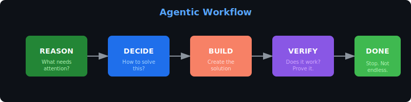
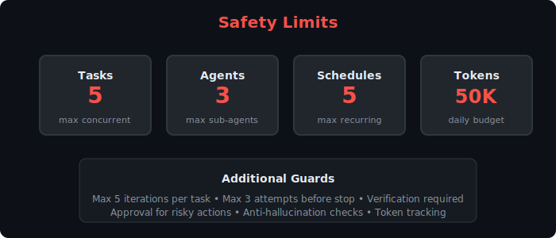
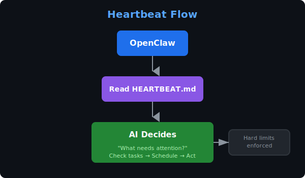
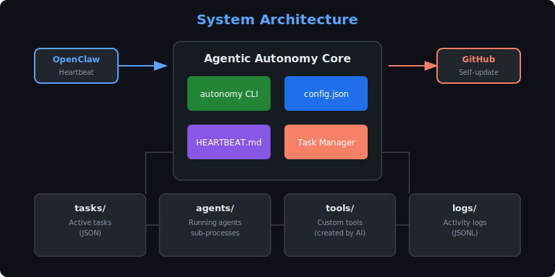
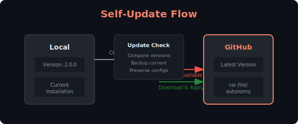

# Agentic Autonomy for OpenClaw

<p align="center">
  
</p>

<p align="center">
  
  
  
</p>

<p align="center">
  <b>AI-driven self-improving autonomy system for OpenClaw.</b><br>
  The AI decides what to do, creates its own tasks, and improves itself — with safety guards to prevent runaway usage.
</p>

---

<p align="center">
  
</p>

---

## Quick Start

```bash
# Activate agentic mode
autonomy on

# Give the AI work
autonomy work "Build a memory tracker for token usage"

# The AI decides, plans, builds, tests, and reports back
```

---

## Commands

### Core Commands

| Command | Description |
|---------|-------------|
| `autonomy on` | Activate agentic mode |
| `autonomy off` | Deactivate |
| `autonomy work "instruction"` | Give the AI a task |
| `autonomy status` | Show workstation status |

### Task Management

| Command | Description |
|---------|-------------|
| `autonomy task list` | Show active tasks |
| `autonomy task create <name> [desc]` | Create a new task |
| `autonomy task complete <name> "proof"` | Mark done (requires proof) |

### Advanced

| Command | Description |
|---------|-------------|
| `autonomy spawn "task"` | Spawn sub-agent |
| `autonomy schedule add <interval> <task>` | Schedule recurring work |
| `autonomy tool create <name>` | Create custom tool |
| `autonomy update check` | Check for updates |
| `autonomy update apply` | Apply latest update |

### Web UI

| Command | Description |
|---------|-------------|
| `python3 web_ui.py` | Start web dashboard (default port 8765) |
| `AUTONOMY_WEB_PORT=8080 python3 web_ui.py` | Start on custom port |

The web UI provides a visual dashboard for:
- Monitoring workstation status
- Viewing active tasks
- Creating new tasks
- Viewing activity logs
- Controlling workstation (activate/deactivate)

---

## Safety Guards

<p align="center">
  
</p>

### Hard Limits

| Limit | Value | Purpose |
|-------|-------|---------|
| Max concurrent tasks | 5 | Prevent overload |
| Max sub-agents | 3 | Limit parallelism |
| Max schedules | 5 | Control recurring work |
| Daily token budget | 50,000 | Cost protection |
| Max iterations per task | 5 | Stop endless building |

### Anti-Hallucination

```
❌ WRONG: "Task complete" (no proof)
✅ RIGHT: "Task complete. Proof: Tested X, verified Y exists"
```

| Guard | Description |
|-------|-------------|
| Verification Required | Must prove work before marking complete |
| Attempt Tracking | Max 3 attempts before forced stop |
| File Verification | Files must exist (actually checked) |
| Command Testing | Commands must work (actually run) |
| Evidence Required | Hand-waving rejected |

### Approval Required

These actions need explicit approval:
- External API calls
- Sending messages
- File deletion
- Public posts
- Git push
- Installing packages

---

## How It Works

<p align="center">
  
</p>

### 1. Heartbeat Triggers

```
OpenClaw → Read HEARTBEAT.md → AI decides what to do
```

### 2. AI Checks Workstation

- Pending tasks?
- Scheduled work due?
- What needs attention?

### 3. AI Reasons & Acts

```
"I should build a token tracker"
  ↓
Create task → Plan approach → Build → Test → Verify → Complete
```

### 4. Verification Required

```bash
# ❌ WRONG - No proof
autonomy task complete X

# ✅ RIGHT - With proof  
autonomy task complete X "Tested: logs tokens, file exists with data"
```

---

## Example Session

```bash
# User activates autonomy
$ autonomy on
✓ Agentic Autonomy ACTIVATED

# User gives work
$ autonomy work "Create a token usage tracker"
✓ Task created: task-1234567890

# (AI takes over on next heartbeat)
# AI thinks: "I need to track tokens. I'll create a script that
# reads session status and logs to a file."

# AI builds it, tests it, verifies it works
# AI marks complete with proof:
# "Tested: Script runs, logs to /logs/tokens.jsonl, has today's data"

# User checks status
$ autonomy status
Workstation: ACTIVE
Active Tasks: 0 (all complete)
```

---

## Architecture

```
skills/autonomy/
├── autonomy              # Main CLI
├── config.json           # Configuration & limits
├── HEARTBEAT.md          # AI instructions
├── ARCHITECTURE.md       # Design docs
├── README.md             # This file
├── checks/               # Update checker
│   └── self_update.sh
├── lib/                  # Shared libraries
├── tasks/                # Active tasks (JSON)
├── agents/               # Running agents
├── tools/                # Custom tools created by AI
├── logs/                 # Activity logs
└── state/                # Runtime state
```

<p align="center">
  
</p>

---

## Assets

<p align="center">
  
</p>

<p align="center">
This plugin includes visual assets:<br>
  <code>assets/logo.svg</code> — Main logo<br>
  <code>assets/logo-banner.svg</code> — Banner for README<br>
  <code>assets/logo-ascii.txt</code> — ASCII art for terminal<br>
  <code>assets/favicon.svg</code> — Favicon for web UI
</p>

---

## Configuration

Edit `config.json`:

```json
{
  "agentic_config": {
    "hard_limits": {
      "max_concurrent_tasks": 5,
      "max_sub_agents": 3,
      "daily_token_budget": 50000
    },
    "completion_criteria": {
      "require_verification": true,
      "max_attempts": 3
    },
    "innovation_guards": {
      "prevent_redundant_builds": true,
      "max_iterations_per_task": 5
    }
  }
}
```

---

## Self-Update

The autonomy can update itself from GitHub:

```bash
autonomy update check    # Check if new version available
autonomy update apply    # Download and install
```

<p align="center">
  
</p>

---

<p align="center">
  <b>MIT License</b><br>
  <sub>Built for OpenClaw — AI that decides, verifies, and improves itself.</sub>
</p>
