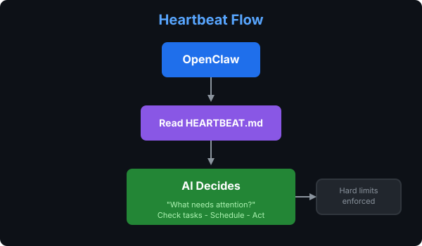

# Autonomy 🤖

<p align="center">
  
</p>

<p align="center">
  
  
  
</p>

<p align="center">
  <b>AI-driven self-improving autonomy system for OpenClaw.</b><br>
  The AI decides what to do, creates its own tasks, and improves itself — with safety guards to prevent runaway usage.
</p>

---

## How It Works

<p align="center">
  
</p>

**The AI follows this loop:**

1. **REASON** — Check what's happening (tasks, schedules, notifications)
2. **DECIDE** — Figure out what needs attention
3. **BUILD** — Create the solution
4. **VERIFY** — Test it and prove it works
5. **DONE** — Mark complete with evidence

### Triggered by Heartbeat

<p align="center">
  
</p>

Every 30 minutes, OpenClaw reads your `HEARTBEAT.md`. The AI checks:
- Pending tasks
- Scheduled work
- System health
- GitHub notifications

Then it decides what to do, with hard limits enforced.

---

## Quick Start

```bash
# Clone to your OpenClaw skills directory
cd "${OPENCLAW_HOME:-$HOME/.openclaw}/workspace/skills"
git clone https://github.com/rar-file/autonomy.git

# Run install script
cd autonomy
bash install.sh

# Start using
autonomy task create "my-first-task" "Explore the autonomy system"
autonomy task list

# Start the web dashboard
python3 web_ui.py
# Open http://localhost:8767
```

---

## Commands

### Task Management

| Command | Description |
|---------|-------------|
| `autonomy task create <name> [desc]` | Create a new task |
| `autonomy task list` | Show all tasks |
| `autonomy task work <name>` | Mark as in-progress |
| `autonomy task complete <name> "proof"` | Mark complete with proof |
| `autonomy task delete <name>` | Delete a task |

### GitHub Integration

| Command | Description |
|---------|-------------|
| `autonomy gh prs` | Your open PRs |
| `autonomy gh reviews` | PRs waiting for review |
| `autonomy gh ci-status` | CI status on default branch |
| `autonomy gh notifications` | Unread notifications |

### System Monitoring

| Command | Description |
|---------|-------------|
| `autonomy vm health` | System health overview |
| `autonomy vm process_list` | List all processes |
| `autonomy vm top_cpu` | Top CPU consumers |
| `autonomy vm docker_ps` | Docker containers |

---

## Safety Guards

<p align="center">
  
</p>

### Hard Limits

| Limit | Value | Purpose |
|-------|-------|---------|
| Max concurrent tasks | 5 | Prevent overload |
| Max sub-agents | 3 | Limit parallelism |
| Max schedules | 5 | Control recurring work |
| Daily token budget | 50,000 | Cost protection |
| Max iterations per task | 5 | Stop endless building |

### Anti-Hallucination

```
❌ WRONG: "Task complete" (no proof)
✅ RIGHT: "Task complete. Proof: Tested X, verified Y exists"
```

| Guard | Description |
|-------|-------------|
| Verification Required | Must prove work before marking complete |
| Attempt Tracking | Max 3 attempts before forced stop |
| File Verification | Files must exist (actually checked) |
| Command Testing | Commands must work (actually run) |
| Evidence Required | Hand-waving rejected |

### Approval Required

These actions need explicit approval:
- External API calls
- Sending messages
- File deletion
- Public posts
- Git push
- Installing packages

---

## OpenClaw Integration

Autonomy uses OpenClaw's native tools instead of reinventing them:

- **Sub-agents**: Uses `sessions_spawn` tool
- **Memory**: Uses `memory_search` / `memory_get` 
- **Scheduling**: Uses OpenClaw cron
- **Heartbeat**: Respects your existing `HEARTBEAT.md`

---

## Example Session

```bash
# User creates a task
$ autonomy task create "fix-auth" "Fix OAuth login bug"
✓ Task 'fix-auth' created

# User checks tasks
$ autonomy task list
  [pending] fix-auth: Fix OAuth login bug

# (On next heartbeat, AI sees the task)
# AI spawns a sub-agent to research OAuth2
# AI creates a fix, tests it, verifies it works
# AI marks complete with proof:
# "Tested: Script runs, login works with OAuth"

# User checks status
$ autonomy task list
  [completed] fix-auth: Fix OAuth login bug
```

---

## Web Dashboard

<p align="center">
  
</p>

Real-time dashboard at `http://localhost:8767`:

- 📋 Live task list with status badges
- 📊 Token usage from OpenClaw API
- 💻 System health (CPU, memory, disk, load)
- 🎨 Dark theme with custom SVG assets
- 🔄 Auto-refresh every 30 seconds

**Start it:**
```bash
python3 web_ui.py
```

---

## Configuration

Edit `config.json`:

```json
{
  "version": "3.0.0",
  "limits": {
    "max_concurrent_tasks": 5,
    "daily_task_budget": 20
  },
  "github": {
    "default_repo": null,
    "notify_on_ci_fail": true
  },
  "web_ui": {
    "port": 8767,
    "auto_refresh": 30
  }
}
```

---

## Assets

<p align="center">
  
</p>

Visual assets included:
- `assets/logo.svg` — Main logo
- `assets/logo-banner.svg` — Banner for README
- `assets/diagram-*.svg` — Workflow diagrams

---

## License

MIT License — Built for OpenClaw

---

<p align="center">
  <sub>Built with 💙 for the OpenClaw community</sub>
</p>
