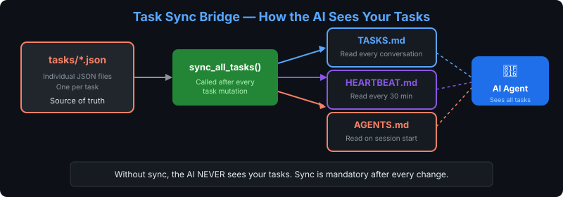
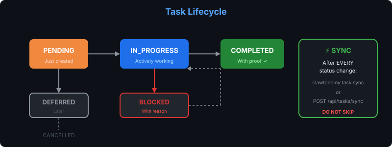
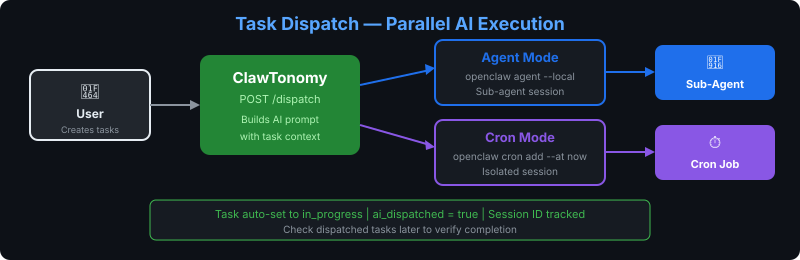
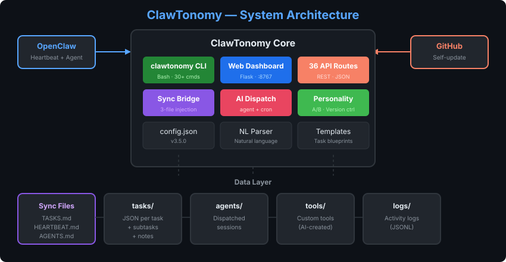
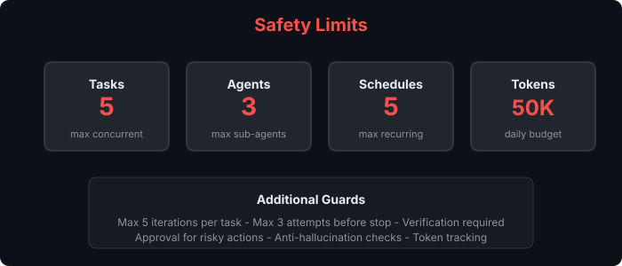
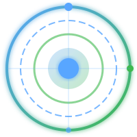

# ClawTonomy

<p align="center">
  
</p>

<p align="center">
  
  
  
  
  
</p>

<p align="center">
  <b>Task management, AI dispatch & self-improving autonomy for OpenClaw.</b><br>
  Create tasks. The AI sees them, works on them, dispatches sub-agents, and syncs everything back — with hard safety guards.
</p>

---

## How It Works

<p align="center">
  
</p>

**The AI follows this loop:**

1. **REASON** — Check what's happening (tasks, schedules, notifications)
2. **DECIDE** — Figure out what needs attention
3. **BUILD** — Create the solution
4. **VERIFY** — Test it and prove it works
5. **DONE** — Mark complete with evidence

### Sync Bridge — The Core Innovation

<p align="center">
  
</p>

OpenClaw has **no native task system**. Without ClawTonomy's sync bridge, the AI never sees your tasks. ClawTonomy solves this by injecting task data into three files the AI already reads:

| File | When AI Reads | What It Contains |
|------|--------------|-----------------|
| `TASKS.md` | Every conversation | Full task list with statuses, priorities, due dates |
| `HEARTBEAT.md` | Every 30 minutes | Overdue warnings, blocked tasks, dispatch status |
| `AGENTS.md` | Session start | Mandatory rules — the AI cannot ignore tasks |

Sync happens **automatically** after every task mutation. No manual steps.

### Task Lifecycle

<p align="center">
  
</p>

Tasks flow through states: **pending → in_progress → completed** (with branches to blocked, deferred, cancelled). Every state change triggers a sync.

---

## AI Dispatch

<p align="center">
  
</p>

Dispatch tasks to parallel AI sub-agents:

```bash
# Dispatch via CLI
clawtonomy task dispatch <name>

# Dispatch via API
curl -X POST http://localhost:8767/api/dispatch \
  -H "Content-Type: application/json" \
  -d '{"task_name": "fix-auth", "mode": "agent"}'
```

**Two dispatch modes:**
- **Agent mode** — `openclaw agent --local` — Interactive sub-agent session
- **Cron mode** — `openclaw cron add --at now` — Isolated background session

Dispatched tasks auto-set to `in_progress`, track `ai_dispatched = true`, and record the session ID.

---

## Quick Start

```bash
# Clone to your OpenClaw skills directory
cd "${OPENCLAW_HOME:-$HOME/.openclaw}/workspace/skills"
git clone https://github.com/rar-file/autonomy.git clawtonomy

# Run install script
cd clawtonomy
bash install.sh

# Create your first task
clawtonomy task create "my-first-task" "Explore the ClawTonomy system"
clawtonomy task list

# Start the web dashboard
python3 web_ui.py
# Open http://localhost:8767
```

---

## Commands

### Task Management

| Command | Description |
|---------|-------------|
| `clawtonomy task create <name> [desc]` | Create a new task |
| `clawtonomy task list` | Show all tasks with statuses |
| `clawtonomy task work <name>` | Mark as in-progress |
| `clawtonomy task complete <name> "proof"` | Mark complete with proof |
| `clawtonomy task delete <name>` | Delete a task |
| `clawtonomy task sync` | Force sync to TASKS.md + HEARTBEAT.md + AGENTS.md |
| `clawtonomy task dispatch <name>` | Dispatch to AI sub-agent |
| `clawtonomy task status` | Show dispatch/sync status |

### Natural Language Tasks

Create tasks in plain English — no flags needed:

```bash
clawtonomy task create "Fix the OAuth bug in auth.py by Friday, high priority"
# → name: fix-the-oauth-bug-in-auth-py
# → due: Friday
# → priority: high
# → tags: [bug, auth]
```

### GitHub Integration

| Command | Description |
|---------|-------------|
| `clawtonomy gh prs` | Your open PRs |
| `clawtonomy gh reviews` | PRs waiting for review |
| `clawtonomy gh ci-status` | CI status on default branch |
| `clawtonomy gh notifications` | Unread notifications |

### System Monitoring

| Command | Description |
|---------|-------------|
| `clawtonomy vm health` | System health overview |
| `clawtonomy vm process_list` | List all processes |
| `clawtonomy vm top_cpu` | Top CPU consumers |
| `clawtonomy vm docker_ps` | Docker containers |

---

## Web Dashboard

<p align="center">
  
</p>

Real-time dashboard at `http://localhost:8767` with **36 API routes**:

- **Task Board** — Live task list with status badges, priorities, due dates, subtask progress
- **Quick Add Bar** — Natural language task creation from the dashboard
- **Dispatch Panel** — One-click dispatch to AI sub-agents
- **Personality Editor** — Edit AI personality with A/B testing and version history
- **Token Usage** — OpenClaw API usage tracking
- **System Health** — CPU, memory, disk, load monitoring
- **Task Templates** — Pre-built task blueprints
- **Dependency Graph** — Visual task relationships
- **Dark Theme** — Custom SVG assets, auto-refresh every 30 seconds

**Start it:**
```bash
python3 web_ui.py
```

### Key API Endpoints

| Method | Endpoint | Purpose |
|--------|----------|---------|
| GET/POST | `/api/tasks` | List / create tasks |
| PUT | `/api/tasks/<name>` | Update task |
| POST | `/api/dispatch` | Dispatch to AI |
| POST | `/api/tasks/sync` | Force sync |
| POST | `/api/tasks/parse` | NL → structured task |
| GET | `/api/tasks/<name>/subtasks` | Get subtasks |
| GET/PUT | `/api/personality` | Personality editor |
| POST | `/api/personality/ab-test` | A/B test personalities |
| GET | `/api/personality/versions` | Version history |
| POST | `/api/digest` | Generate daily digest |
| GET | `/api/context-window` | AI context usage |

Full API reference: see [SKILL.md](SKILL.md)

---

## Safety Guards

<p align="center">
  
</p>

### Hard Limits

| Limit | Value | Purpose |
|-------|-------|---------|
| Max concurrent tasks | 5 | Prevent overload |
| Max sub-agents | 3 | Limit parallelism |
| Max schedules | 5 | Control recurring work |
| Daily token budget | 50,000 | Cost protection |
| Max iterations per task | 5 | Stop endless building |

### Anti-Hallucination

```
WRONG: "Task complete" (no proof)
RIGHT: "Task complete. Proof: Tested X, verified Y exists"
```

| Guard | Description |
|-------|-------------|
| Verification Required | Must prove work before marking complete |
| Attempt Tracking | Max 3 attempts before forced stop |
| File Verification | Files must exist (actually checked) |
| Command Testing | Commands must work (actually run) |
| Evidence Required | Hand-waving rejected |

### Approval Required

These actions need explicit approval:
- External API calls
- Sending messages
- File deletion
- Public posts
- Git push
- Installing packages

---

## OpenClaw Integration

ClawTonomy is built specifically for OpenClaw:

- **Sync Bridge** — Injects tasks into TASKS.md, HEARTBEAT.md, AGENTS.md so the AI actually sees them
- **Sub-agents** — `openclaw agent --local` for parallel dispatch
- **Cron** — `openclaw cron add` for scheduled/background tasks 
- **Heartbeat** — Respects your existing HEARTBEAT.md (injects between markers)
- **Memory** — Uses `memory_search` / `memory_get` for context
- **Skills** — Registered as an OpenClaw skill via SKILL.md

---

## Configuration

Edit `config.json`:

```json
{
  "version": "3.5.0",
  "limits": {
    "max_concurrent_tasks": 5,
    "daily_task_budget": 20
  },
  "github": {
    "default_repo": null,
    "notify_on_ci_fail": true
  },
  "web_ui": {
    "port": 8767,
    "auto_refresh": 30
  }
}
```

---

## Example Session

```bash
# User creates a task (natural language)
$ clawtonomy task create "Fix OAuth login bug, high priority, due Friday"
Task 'fix-oauth-login-bug' created (priority: high, due: Friday)

# Check tasks
$ clawtonomy task list
  [pending] fix-oauth-login-bug: Fix OAuth login bug (priority: high, due: Fri)

# Dispatch to AI sub-agent
$ clawtonomy task dispatch fix-oauth-login-bug
Dispatched 'fix-oauth-login-bug' via agent mode
Session: sess_abc123

# AI works on it in parallel...
# Later, check status:
$ clawtonomy task list
  [completed] fix-oauth-login-bug: Fix OAuth login bug
    Proof: "Fixed token refresh in auth.py:47. Tested: login works with OAuth"
```

---

## Assets

<p align="center">
  
</p>

Visual assets included:

| Asset | Description |
|-------|-------------|
| `assets/logo.svg` | Main logo |
| `assets/logo-banner.svg` | Banner with badges |
| `assets/diagram-workflow.svg` | 5-step agentic workflow |
| `assets/diagram-sync.svg` | 3-file sync bridge flow |
| `assets/diagram-dispatch.svg` | AI dispatch architecture |
| `assets/diagram-lifecycle.svg` | Task status lifecycle |
| `assets/diagram-architecture.svg` | Full system architecture |
| `assets/diagram-heartbeat.svg` | Heartbeat injection flow |
| `assets/diagram-limits.svg` | Safety limits overview |
| `assets/diagram-update.svg` | Self-update mechanism |

---

## Documentation

| Doc | Purpose |
|-----|---------|
| [SKILL.md](SKILL.md) | OpenClaw skill manifest — full API reference, 12 mandatory rules |
| [FULL_AUTONOMY.md](FULL_AUTONOMY.md) | Complete autonomy capabilities reference |
| [USAGE.md](USAGE.md) | Human + AI agent usage guide |

---

## License

MIT License — Built for OpenClaw

---

<p align="center">
  <sub>Built with 🔧 for the OpenClaw community — ClawTonomy v3.5.0</sub>
</p>
